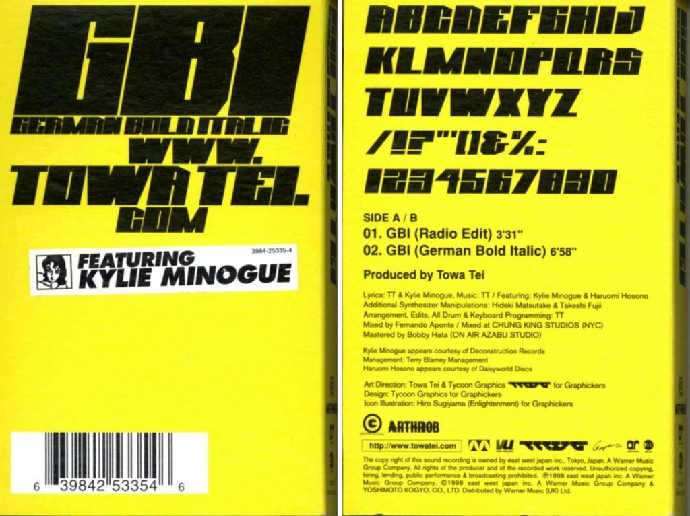

[https://abcdinamo.com/news/german-bold-italic](https://abcdinamo.com/news/german-bold-italic) [[archive](https://web.archive.org/web/https://abcdinamo.com/news/german-bold-italic)]

> (Hello) My name is German Bold Italic \
I am a typeface \
Which you have never heard before \
Which you have never seen before \
I can compliment you well \
Especially in red \
Extremely in green \
Maybe in blue (blue, blue) \
You will like my sense of style (×4) \
Gut ja! Ow!

The very interesting story behind Kylie Minogues [German Bold Italic](https://www.youtube.com/watch?v=4Fw2Labli4k) hit and the associated typeface. You can [download it here](https://web.archive.org/web/20041130183630/http://www.kylie.co.uk/desktop/gbi.TTF) from an archived version of her website.
