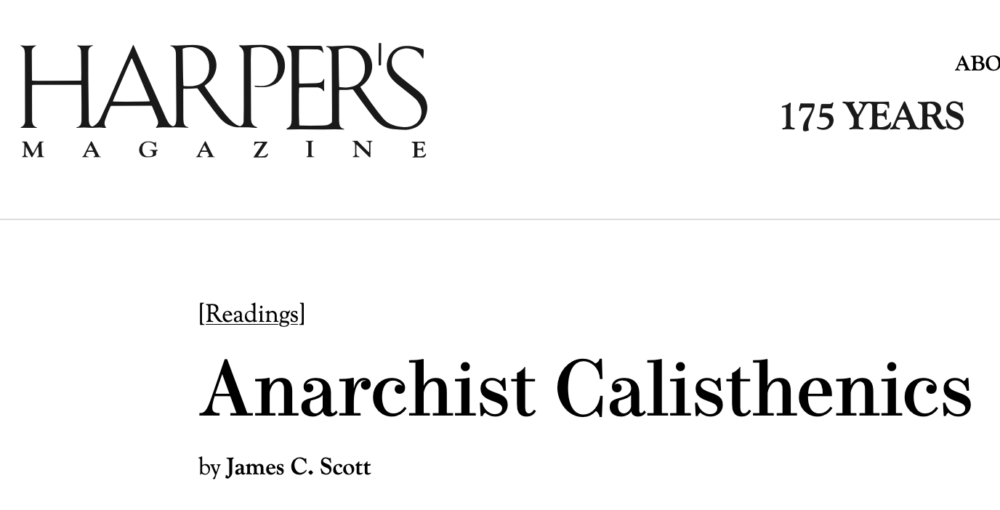

[https://harpers.org/archive/2012/12/anarchist-calisthenics/](https://harpers.org/archive/2012/12/anarchist-calisthenics/) [[archive](https://web.archive.org/web/https://harpers.org/archive/2012/12/anarchist-calisthenics/)]

> One day you will be called on to break a big law in the name of justice  and rationality. Everything will depend on it. You have to be ready. How are you going to prepare for that day when it really matters? You have  to stay ‘in shape’ so that when the big day comes you will be ready.  What you need is anarchist calisthenics. Every day or so break some  trivial law that makes no sense, even if it’s only jaywalking.

From a useless traffic light in Neubrandenburg to urban planning in Drachten, an essay so  inspiring.