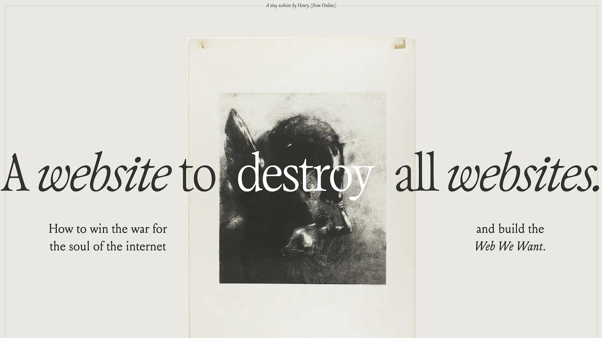

[https://henry.codes/writing/a-website-to-destroy-all-websites/](https://henry.codes/writing/a-website-to-destroy-all-websites/) [[archive](https://web.archive.org/web/https://henry.codes/writing/a-website-to-destroy-all-websites/)]

> The rampant industrialization and commercialization of the Web predictably develops flashy, insidious patterns of extracting capital from its users: new surfaces for information means new surfaces for advertisement, and new formats of media beget new mechanisms for divorcing you from their ownership.

part nostalgia for the past, part invocation to take back the web. all packaged in one of the best website designs ive seen in a while.
