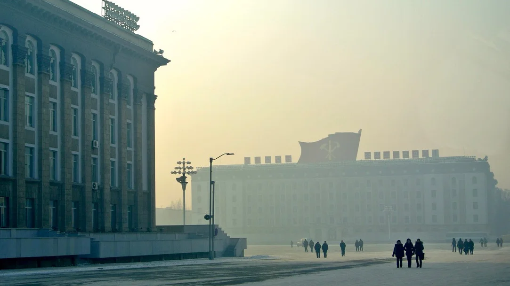

# North Korea: It might not get any weirder than this

Author

Sophie Schmidt

Published

March 1, 2026

<https://restofworld.org/2013/sophie-in-north-korea/> \[[archive](https://web.archive.org/web/https://restofworld.org/2013/sophie-in-north-korea/)\]

> Three channels on the TVs: CNN International, dubbed-over USSR-era films, and the DPRK channel, which was by far the most entertaining. My tolerance level for videos of Kim Jong Un in crowds turns out to be remarkably high.

Sophie Schmidt (the daughter of google founder Eric Schmidt) on her north korean propaganda trip in 2013. Very strange, but very interesting. And a bunch of eery and weird but great pictures.
