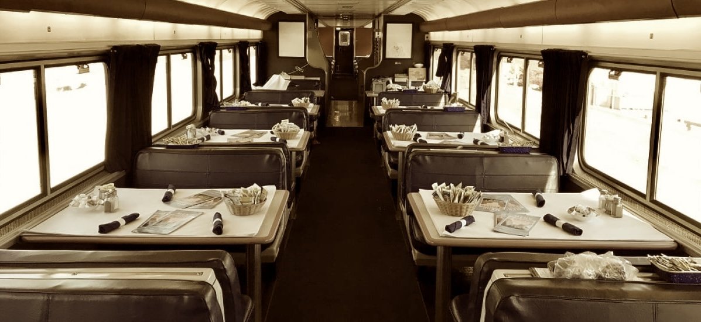
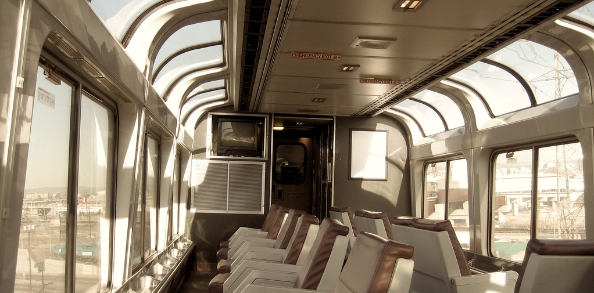
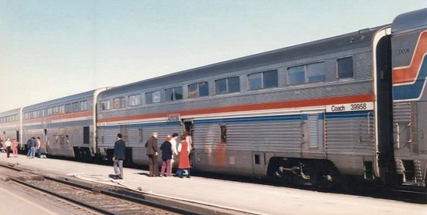
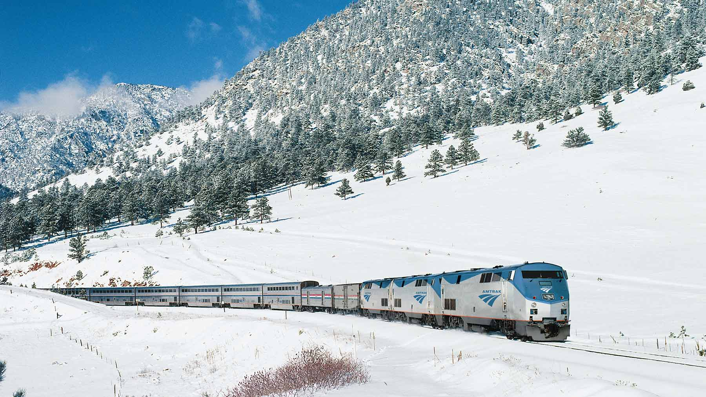

***`O`kay, almost A to Z***. A little overview of what to expect on an Amtrak trip, as well as some tips. Best to start with [Railpass ***→ R***](#R) to learn more about the cheapest way to travel on Amtrak, or [Utensils to bring ***→ U***](#U). Also, if you want to know more about the best route, check out [Zephyr ***→ Z***](#Z). Alternatively, just scroll trough the alphabet and see what catches your eye.

## A - Amish {#A}

The largest group of your fellow [passengers ***→ P***](#P) will probably be the Amish, especially in the Northeast and Midwest. Travel in large groups, often in traditional clothing, with their characteristic hats and beards. As they don't use smartphones, they are not bothered by the lack of [internet ***→ I***](#I), playing cards in the [observation car ***→ O***](#O) instead. 

## B - Beds {#B}

If youre lucky enough to snag a sleeper car, youll have access to beds. These are quite space-efficient, but still very comfortable. They also feature a [toilet ***→ T***](#T) and a small sink in every room. And [Dinner ***→ D***](#D) is included in the price of the ticket!

If youre travelling coach, well you dont have access to beds. But the seats are very comfy and you have quite a lot of [legroom ***→ L***](#L).

## C - Cafe {#C}

Large selection of snacks and drinks, and not as bad as expected. In [super liner ***→ S***](#S) trains, the cafe is located on the lower level, and has a small seating area, with the [Observation car ***→ O***](#O) above it. Closes at 10pm.

## D - Dining {#D}

3 course menus for Dinner, 2 course for lunch. Food is pretty good, and they often have space for coach [passengers ***→ P***](#P). If youre that, you can walk in during dinner time, and if they have space, you can eat there for 45$. Youll be sharing a table with other passengers, which sounds weird at first. But you should definitely try it, it's where I had the most interesting conversations with other passengers. 

## E - Earplugs {#E}

Definitely one of the [utensils to bring ***→ U***](#U). The tracks are quite old, so it can be quite noisy. 

## F - Fresh air {#F}

Youre travelling in a metal box and sitting for long stretches of time, so take the chance at each stop and catch some fresh air. In some trains, you can also open the windows on the lower level, and put your head out :)

## G {#G}

## H {#H}

## I - Internet {#I}

The Amtrak rail [network ***→ N***](#N) leads trough some pretty remote areas, with VERY spotty internet (if you even have any). So download movies / podcasts / music before you get on the train, and don't expect to have long calls with friends on your trip. 

## J {#J}

## K {#K}

## L - Legroom {#L}

Only relevant for coach passengers, but the leg room is really great (especially if you compare it to planes / cars). Combined with the reclining seat, which can be reclined almost to a 45 degree angle, you can really get comfortable for a long trip. I am 6"3 and I was barely touching the seat in front of me with my feet.

## M - Map (transitdocs) {#M}

Amtrak has a lot of delays, and the trains can stop for quite some time on their way. I found the best way to chekc up on my itinerary and train status was the [transitdocs map](https://asm.transitdocs.com/map). It is a live map of all the trains, and you can click on your train to see its current status, and if there are any delays.

## N - Network (Amtrak) {#N}

Amtrak's long-distance network is quite extensive, servicing more than 300 stations and transporting ca 3 million passengers a year. I reccomend the [California Zephyr ***→ Z***](#Z) route, but all routes feature some scenic nature views and interesting cities. Long-distance routes aloways involve at least one overnight stay, and therefore the trains are equipped with sleeper cars and dining cars, mostly in the form of [superliner ***→ S***](#S) trains. To see an up to date schedule, I recommend the [transitdocs map ***→ M***](#M).

](network.jpg)

## O - Observation car {#O}

The observation car is the best place on the train. Featuring full-height windows, it's where you should sit and et the country pass by. You can turn the seats to face the windows, get a drink in the [cafe ***→ C***](#C) downstairs, and enjoy the view. Maybe even get to know some of your fellow [passengers ***→ P***](#P) while youre at it.

## P - Passengers {#P}

The people you'll be spending your time with. Made up of a mix of [Amish ***→ A***](#A), seniors, backpackers, and foreign tourists expecting trains to be an adequate mode of transportation. Some tend to snore, so bring your [earplugs ***→ E***](#E). As you'll probably be spending extended time with them, maybe get a conversation going. Mostly they are very interesting people (who else would choose to spend 2 days on a train?).

## Q {#Q}

## R - Railpass {#R}

Cheapest way to get around the US: the Amtrak RailPass. For 500$, you get 10 trips within 30 days, which can take you across the US and back. Really recommended, but you can only travel coach with it, so no [beds ***→ B***](#B) for you. 

**Note**: Often times, the RailPass is reduced in January for travel from Jan till April. [e.g [2024](https://media.amtrak.com/2024/01/usa-rail-pass-sale-2024/), [2025](https://www.travelandleisure.com/amtrak-usa-rail-pass-flash-sale-8773329), [2026](https://media.amtrak.com/2026/01/amtrak-offers-250-usa-rail-passes-for-a-limited-time/)]. I got mine in January 2026 for 50% off, so 250$ instead of 500$, which is a steal for 10 trips across the US. 

## S - Super liner {#S}

Train type used by Amtrak on the long-distance routes. It's a double decker train, featuring [dining car ***→ D***](#D), [observation car ***→ O***](#O), and sleeper cars with [beds ***→ B***](#B). The last ones were built in the 1990s, so don't expect modern amenities. Good thing about them nbeing quite old, is that the spacing was designed before EasyJet / WizzAir got us used to very little room, so the beds and seats are quite spacious. Most passenger seats are located on the upper level, so you'll always have a good view.

## T - Toilets {#T}

Better than expected (for real). If you're in a sleeper car, you'll have your own, so it doesn't matter. If you're in coach, the toilets are located in the lower level, and on most trips there were 5 toilets per car (including one very spacious changing room). Never had a line, running hot and cold water, and mostly working. Very high water pressure in the taps!

## U - Utensils to bring {#U}

Here's a list o things you should bring on your trip:

- [Earplugs ***→ E***](#E)
- Sleeping mask
- Books (to read in the [observation car ***→ O***](#O))
- Download movies / podcasts / music (for when you have no [internet ***→ I***](#I))
- Neck pillow
- [Water ***→ W***](#W)
- Cleaning wipes (as coach passengers dont have a shower, you might want to freshen up a bit) 
- Patience (Amtrak is notorious for delays)

## V - Voucher {#V}

If you have one of the inevitable delays, you'll get a voucher. [Railpass holders ***→ R***](#R) get 50$ vouchers (a.k.a 1/10th of the price of the railpass), so if you have a an extra train you want to take, use the voucher. Otherwise, just keep it in case you want to take another trip within the next year.

## W - Water {#W}

Bring a lot. The trains don't have a refilln station (or I did not find it), and the water they sell in the [cafe ***→ C***](#C) is quite expensive. You'll be on the train for quite some time, so stay hydrated – bring at least 2 liters.

## X {#X}

## Y {#Y}

## Z - Zephyr {#Z}

The best route in the Amtrak [network ***→ N***](#N) IMO. If you only take one train in your life, it should be this one. Starts in Chicago, ends in Oakland, and takes you through the most scenic parts of the US: the Rocky Mountains, the Colorado River, the Sierra Nevada mountains. Maybe get off in the middle (e.g Denver or Salt Lake City) and see the beautiful nature up close. Make sure to grab a seat in the [observation car ***→ O***](#O) during the Donner Pass or the as you go through the Rocky Mountains, the views are breathtaking..

