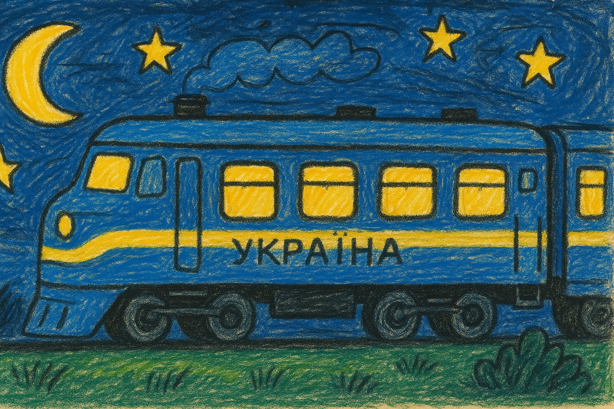
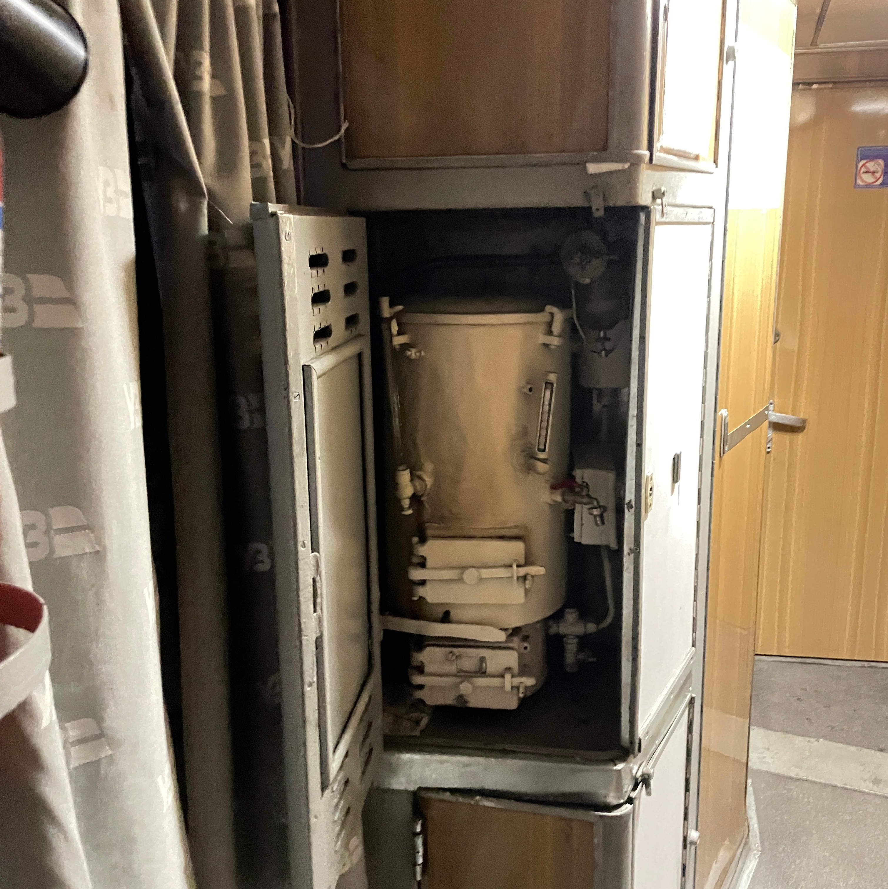
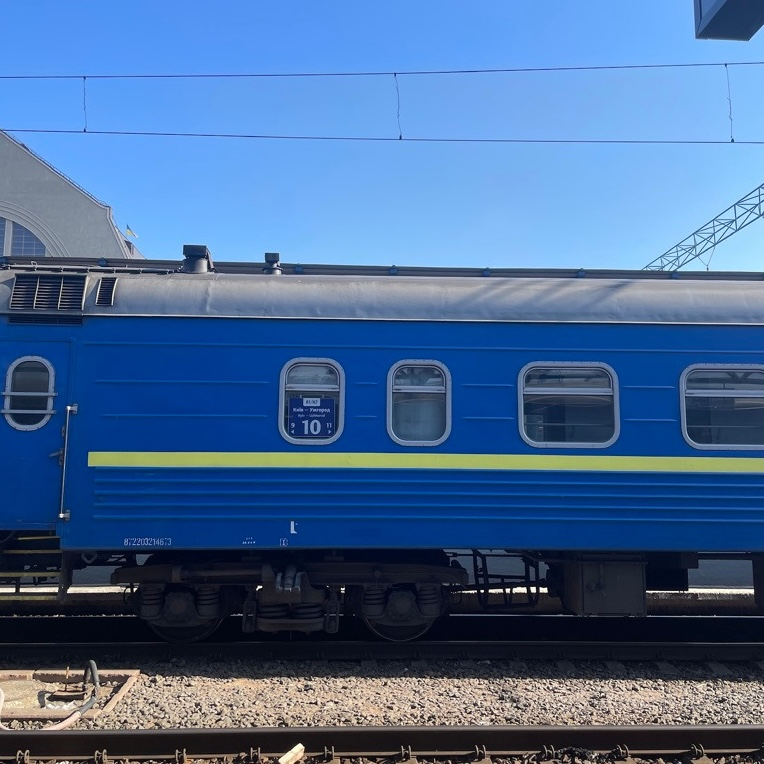
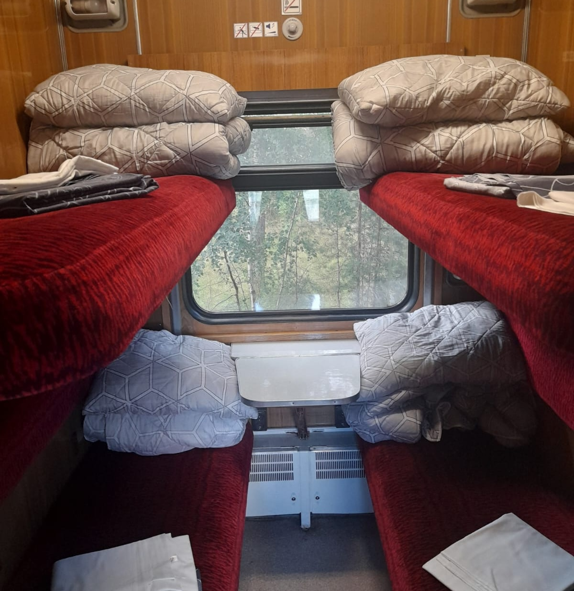

Das Design ist inzwischen allgegenwärtig bekannt. Die blaue Farbe mit den gelben Streifen, die hohen Stufen, der etwas alte Look. Meist sehen wir ihn im Bild mit wichtigen Politikern, sei es Friedrich Merz, Keir Starmer, Emmanuel Macron oder alle 3 zusammen. Die Rede ist: von dem Nachtzug der ukrainischen Staatsbahn.

Man muss aber nicht zwingend ganze Staaten lenken, um auch die Chance auf ein kleines Abenteuer mit dem Zug zu haben. Für unter 10€ fährt er auch unbedeutende Menschen zwischen Lviv und Kyiv komfortabel durch die Nacht (allerdings mit 3 anderen im Abteil)

Verglichen mit anderen Nachtzugstrecken in Europa ist es einer der gemütlichsten. Die Betten sind vergleichsweise dick, die Decken sind ordentlich, wenn auch etwas kratzig und das Personal unglaublich freundlich. Und das ganze versprüht einen post-sowjetischen Charme, den nicht einmal das steinalte rumänische Zugnetz übertreffen kann.

Wie kann ich jetzt Teil dieses zugförmigen Objekts der Zeitgeschichte werden? Eigentlich ganz einfach. Die Buchung ist volldigital, das Ticket wird einem digital auf ukrainisch ausgespuckt. Bett oben oder unten hängt von den eigenen Präferenzen ab, oben hat man definitiv mehr Platz zum Atmen und Sachen zu verstauen, muss sich aber dafür auch die etwas versteckte und komplizierte Leiter hinaufbugsieren. Außerdem staut sich dort die Hitze (dazu später mehr).

Vor Abreise muss das Ticket zwingend ausgedruckt werden! Bei Ankunft am Bahnhof wird man zum Waggon geschickt, in dem man die Nacht verbringt, und die *provídnytsja* (eine Art Zugbegleiterin für jeden Waggon) verstaut das Ticket für die Reise. Dann sein Zeug in die Metallkäfige unter den Betten verstauen und ab gehts. An das Gepäck kommt man danach nicht mehr ran, ohne die anderen Leute von ihren Betten aufzuscheuchen, also alles wichtige direkt rausnehmen. 

Da es keine Sitze oder ein Bordrestaurant gibt, verbringt man gezwungenermaßen viel Zeit im Abteil. Vorteil wenn man das untere Bett hat: es ist definitiv eine bessere Sitzmöglichkeit, und man kann anderen direkt beim Sitzplatz anbieten ins Gespräch kommen. Sonst ist auch im Gang stehen super, dort gibt es wenigstens aus den Fenstern etwas Frischluft.

Das ist der kleine Nachteil der antiquierten Innenausstattung: Eine Klimaanlage ist nicht Teil davon. Selbst im kühleren März hat sich der Zug ordentlich aufgeheizt, und die kleinen Spalten in den Fenstern machen dabei nicht den größten Unterschied. Die Hitze im Hochsommer möchte ich mir nicht unbedingt vorstellen, aber das ist ja in ICEs mit ausgefallener Klimaanlage nicht anders. 

Die größte Hitzequelle des Zuges ist der Samowar, eine Art Kochwassertopf. Durchgehend warm gehalten durch das beständige Kohleschaufeln der provídnytsja, eröffnet das Wasser ungeahnte Möglichkeiten. Tee oder Kaffee gibt für wenige Cent bei den Zugbegleitern zu ersteigern, und auch ne Packung Ramen verwandeln sich schnell zum perfekten Late-Night Snack.

Nach mehreren Stunden Fahrt durch die pechschwarze Nacht dann die Ankunft. Hoffentlich nicht so dehydriert wie wir (zu faul noch eine Flasche Wasser zu schleppen) wartet direkt Kyiv.

|   |      |                  |
| ----------- | --------------- | --------------------------- |
| der samowar | die aussenseite | die bequeme innenaustattung |

Mehr Infos:
- [Zeit Reportage über die Nachtbegleiterinnen im Zug](https://www.zeit.de/2025/30/nachtzug-kyjiw-schaffnerin-zugbegleiterin-politiker)
- [Online Buchungsportal](https://booking.uz.gov.ua/en)
- [Reise bei Man in Seat 61](https://www.seat61.com/Ukraine.htm), die beste Website für Züge in Europa!
