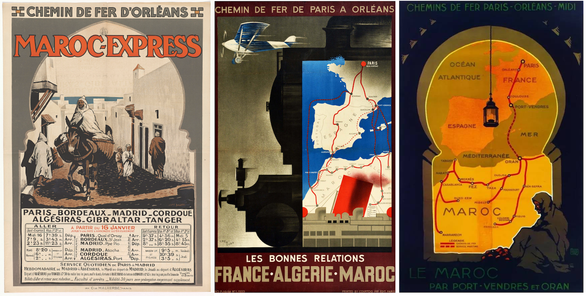
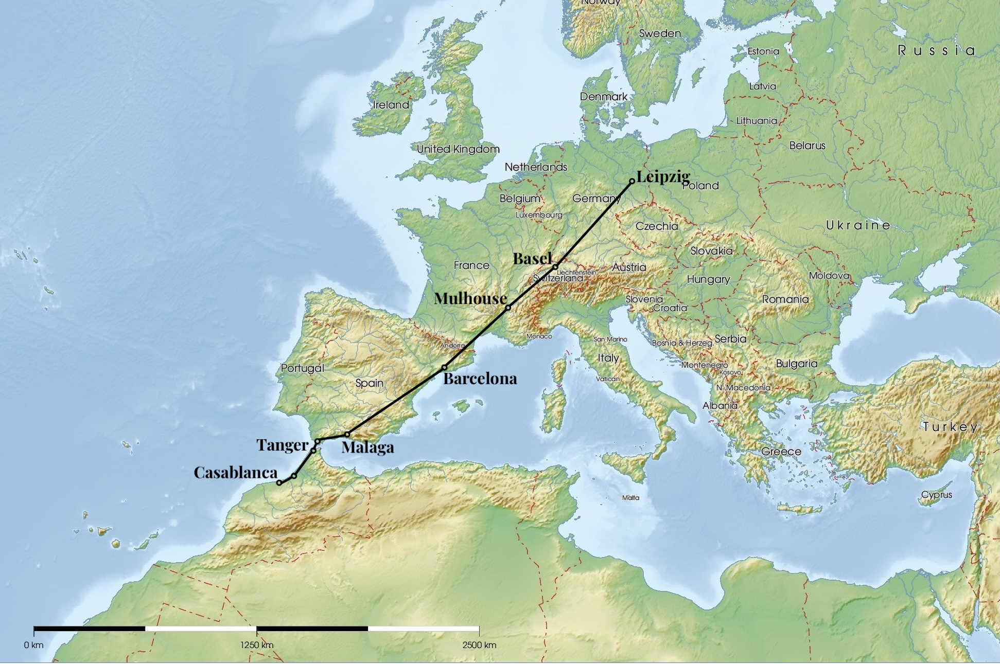

# Taking the train from Germany to Morocco

A Lunatics guide on how to travel from Leipzig to Casablanca without flying. Works (almost) perfectly and is definitely more fun than being squeezed into a small seat on Ryanair.

Published

February 1, 2024

## On this page

- [First 1.5 Days: Leipzig to Barcelona](#first-1.5-days-leipzig-to-barcelona)
- [Second Day: Barcelona - Malaga](#second-day-barcelona---malaga)
- [Third Day: Malaga - Casablanca](#third-day-malaga---casablanca)
- [Conclusion](#conclusion)

Art-Deco posters by the Chemin de Fer D’Orleans

***Ahh, Morocco. a beautiful country***, especially during the long and depressing Northern European winter. Only problem: about 3500km distance and a climate consciousness that makes you not want to fly.

So, how to get from Leipzig to Morocco by train and ferry? Be prepared for a multi-day trip with several stops in beautiful cities along the way.

*Tip*: Get an Interrail ticket, especially in Western Europe it is very advisable and definitely worth the cost compared to normal train ticket prices! And if you are trying to look up train times, use the [Train Planner on the Interrail website](https://www.interrail.eu/en/plan-your-trip/interrail-timetable#/).

Travel Map

## First 1.5 Days: Leipzig to Barcelona

***The first itinerary takes you directly to Barcelona.*** I chose the night train from Leipzig to Basel (very uncomfortable and bright at night) to reach the Swiss city early in the morning. Everything is too expensive there, so we move on quickly.

Because of the Swiss-French madness and a missing direct train, we have to get to Mulhouse first, before we can go some distance to Valence. Here we get off the train and get something to eat and definitely some *patisserie*. Unfortunately, the TGV station in Valence is, like so many others, just a station in the middle of nowhere, optimized for fast travel and not for comfortable stays.

With a few croissaints in your system, the last step of the first day is the high-speed train to Barcelona-Sants. Note the scenic route at the end through mountains on the coast, so if youre lucky with your reservation and have a window, take some pictures.

Arriving in the evening, quickly check into your hostel, drop off your stuff and enjoy the wonderful city at night.

| Train               | Departure | Arrival | Reservation Cost |
|---------------------|-----------|---------|------------------|
| Leipzig - Basel     | 23h45     | 7h20    | 16€              |
| Basel - Mulhouse    | 8h51      | 9h14    | /                |
| Mulhouse - Valence  | 9h58      | 13h46   | 12€              |
| Valence - Barcelona | 15h11     | 19h34   | 10€              |

## Second Day: Barcelona - Malaga

***Enjoy some sun and culture*** in the capital of Catalonia the next day. In the afternoon, board a comfortable train to Malaga. Train travel in Spain is very much organized like flying, so do not be surprised by the boarding procedure and gates at Barcelona-Sants. After about 7 hours you will arrive at the wonderfully named Malaga Maria Zambrano station in the evening.

Find a cheap hostel where you can quickly reach the sea and enjoy the city. Dont forget to at least enjoy the view of the old moorish [Alcazaba Fortress](https://en.wikipedia.org/wiki/Alcazaba_of_M%C3%A1laga) if youre staying for longer than one night (recommended).

| Train              | Departure | Arrival | Reservation Cost |
|--------------------|-----------|---------|------------------|
| Barcelona - Malaga | 15h15     | 21h43   | 12€              |

## Third Day: Malaga - Casablanca

***The third day is the most stressful.***

> First of all, do not take the ferry from Algeciras! It does not arrive in Tanger Ville, but in Tanger Med, the port far outside the city. It is also much slower than the one from Tarifa.

Early in the morning take the bus from Malaga to Tarifa, [line 501](https://malaga.avanzagrupo.com/es/itinerarios-y-horarios/lineas/501-l501-malaga-cadiz-ruta). It should arrive at its destination at 11h30, which gives you enough time to have a snack before boarding the ferry at 13h. Do not waste too much time as the boarding process takes some time and the port is quite far from the bus stop.

Passport control takes place on the ferry. It starts right after leaving the port and takes the whole time, so just enjoy the beautiful view of the Strait of Gibraltar (by the way, it has very strong currents, so if you tend to get seasick, bring medicine).

After two hours you will reach *Port de Tanger Ville*. Do not get ripped off by some taxi drivers who want to take you to the city, just take the short ugly walk through the port area. You will save some money and you can see some of the locals fishing. If you want to go directly to Casablanca, walk through the old part of the city and get on one of the public buses. You do not need cash to get on the bus, they will accept your credit card if you hold it up to a terminal inside the bus. (Google Maps lists all the buses and routes)

Depending on where you got on the bus, it should take you directly to the train station *Tanger Ville*. If you have not booked your ticket yet, you can easily buy one at the digital kiosks in the station. Do not forget the time needed for boarding!

The train from Tanger to Casablanca is the very comfortable *Al-Boraq* high speed train (the same as the TGV). After 2 quick hours, you will arrive in the beautiful city of Casablanca, probably at the *Casa Voyageurs* station. The T1 tram starts right in front of the station, so don’t bother the taxi drivers again, public transport will take you almost everywhere.

| Connection          | Departure | Arrival | Cost    |
|---------------------|-----------|---------|---------|
| Malaga - Tarifa     | 7h30      | 11h30   | 12-20€  |
| Tarifa - Tanger     | 13h       | 14h     | 40.25€  |
| Tanger - Casablanca | 15h       | 17h10   | ca. 27€ |

Booking Links

- Bus: [AVANZABUS](https://booking.avanzabus.com)
- Ferry: [FRS](https://booking.frs.es/#/en/book)
- Moroccan Train: [ONCF](https://www.oncf-voyages.ma/)

## Conclusion

All in all, the drive is very scenic and takes you through half of Europe.

- Is it cheaper than flying? Definitely not!
- Is it better for the environment? Yes (100kg CO2 vs 1t)
- Is it more fun than cramming into a Ryanair seat? Definitely!

**Tip**: The Man in Seat 61 is **the** recommended website to find out how to get somewhere by train. Take a look at the guide to get from [London to Morocco](https://www.seat61.com/Morocco.htm) or the [Train Guide to Morocco](https://www.seat61.com/train-travel-in-morocco.htm) before going!
