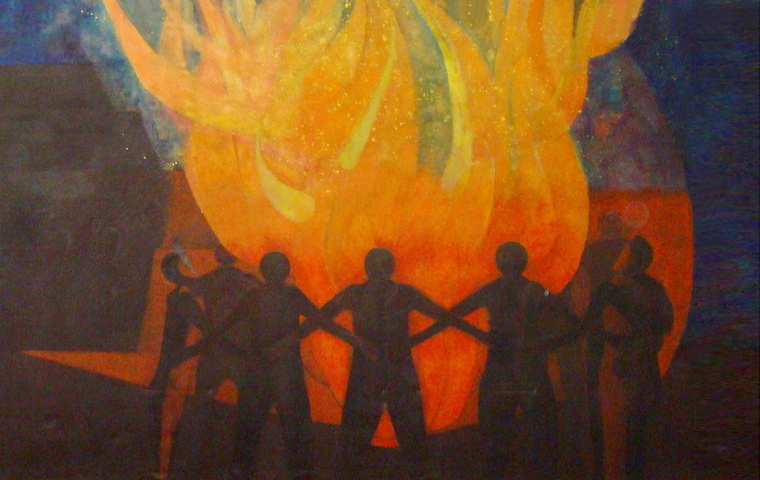

## The Work

]](delegates.jpg)

- depends really on your department, office, team even
- i dont allow myself to comment on workload / responseibilites, differs even among interns

generally
- lot of tasks (luckily not my role) are note-taking and summarisation tasks
- aka you sit in sessions of the Security Council, listen to important people speak and report back to your organisation / department
- can be quite dull, but its the sausage making process (ref) of international politics

to keep in mind:
- UN = dire financial situation!
- some countries just dont pay their dues (or very late)
- and there is a round of budget cuts every second month it feels like
- a lot of resources are just not there
    - many interns did not get a work laptop, had to use their own
    - some didnt even get a UN email adress (lookning at you DESA)
- and if youre hoping for a follow up position, you may have to stop dreaming
- its very tough at the moment, not a lot of interns got one
  - and if they did, it was very short contract lengths (ca 3 months)
- bonus of the situation: interns get a lot more tasks and responsibilities, because there is just too much work for too few hands

this sounds bad:
- its still a privilege to be working in this environment in the heart of international politics
- just important to know before getting there - anchor expecations to reality
- the UN is not always this large bureacratic institution, especially your direct coworkers doing wonderful work desprite these constraints

## The Pay

you probably know this by now: there is no pay. Zero. Nada. Niente. 
- interns are the cheap expendable workforce keeping the UN running
- shameful for an organisation priding themselves on values, but not even paying fair wages

- I was lucky to get a scholarship by the german government (if youre german, you can read more about the application process [here](../carloschmid/))
- some other states offer something similar to their citizens (china, usa)
- I got ca 2200$ per month, which can be enough to survive in this city
  - you can definitely live on less
  - and obviously on more
- it really depends on your rent and how much you cook at home
- i would suggest having some buffer in case of unexpected AUSGABEN

tips:
- fair fares NYC: subsidized subway transport on the MTA, 50% off
- many SROs in the UES and UWS are quite cheap and are well located to reach the UN
- the city has a lot to offer without money 
    -  get a NYC ID card for a lot of discounts everywhere

## The People

A

not paying your interns ofc leads to a selection of people who work there
- upper class / rich kids who can afford to go without pay in one of the most expensive cities in the world
- often times from very good universities (think Science Po, Columbia etc), where it is almost expected that you do something like this
- but there is quite a range of people there
    - from all over the world, from a lot of different backgrounds

- wouldnt worry about it too much
- you almost always have other interns on your floor you can connect with
- and happy hours / free events where you meet a lot of other people

## Interlude: The Food

]](dining.jpg)

just a quick side rant

- there used to be a beautiful restaurant for UN staff on the first floor
    - very elegant, very good food
- closed during the pandemic, and never reopened (budget cuts)
- now, theres the riverview cafeteria
    - food is meh, prices are exorbitant, and it feels like youre having lunch in a multifunctional conference room

- if you leave the UN, youre in midtown, the worst neighboorhood for good things to eat
- a large selection of shops offering slop salad bowls for burnt out office workers
- only Lichtblick: the amish market with cheap pizza, salads and sushi
  - but then you have to go back trough security, which can take its time (especially in tourist season where everyone wants to see the city)

## The City

]   Right: Robert Frank, United Nations Building (1954) [[NGA.gov](https://www.nga.gov/artworks/89446-united-nations-building-new-york-city-no-number)]](building.png)

and there is a reason for that

- i dont need to tell you, new york is just crazy
- in good and bad ways
- you gotta see for yourself, but its so worth it

- so much to offer, (dive) bars, clubs, museums, politics
- does not have to be expensive 
  - for a tase: the skint newsletter, culturepass (for free museum entry), free gyms and pools (recreation centers), great public libraries (NYPL), i could go on and on and on

## The End

All in all, a great experience
- considerable financial barrier
- but if you can overcome that (please dont sell a liver for that though)
- so worth it
- try to apply 
    - i cant help you with that, because what the hiring managers look for is so different for every position

Good Luck!